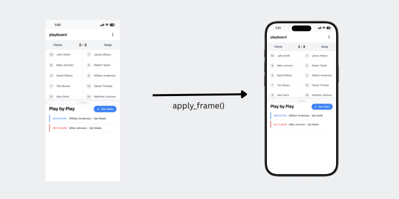

# device-frames [View on npm](https://www.npmjs.com/package/device-frames)

TypeScript/Node core library for applying device frames to screenshots and retrieving up-to-date media of device frame PNGs (with metadata)



### Usage Example

```bash
npm install device-frames
```

```ts
import { applyFrame, listDevices } from "device-frames";

// List devices
const allDevices = await listDevices();

// Apply a frame
await applyFrame(
  "input.png",
  "16-pro-max",
  "black-titanium",
  "output/framed.png",
  { category: "apple-iphone" }
);
```

Notes
-----

- Device frames and masks are fetched at runtime from https://github.com/jonnyjackson26/device-frames-media. This ensures you always have updated data. If you need a frame that's not listed there, please [add it](https://github.com/jonnyjackson26/device-frames-media?tab=contributing-ov-file)
- The package depends on [sharp](https://sharp.pixelplumbing.com/) for image compositing, so it runs in Node.js (server, CLI, build scripts) — not in the browser.
- Device and variation names use lowercase kebab-case (e.g., "16-pro-max", "black-titanium").

### Local Testing with tests/test.ts:
```bash
npm install
npm test              # run test file
```

### Local package build
```bash
rm -rf dist
npm install
npm run build          # compiles src/ to dist/
```
Install the built package locally and do a quick import check:
```bash
npm pack
npm install ./device-frames-*.tgz
node -e "import('device-frames').then(m => m.listDevices().then(d => console.log(d.length)))"
```

### CI
Every push and pull request to `main` runs [`.github/workflows/ci.yml`](.github/workflows/ci.yml), which builds and runs the test suite on Node 18, 20, and 22.

### Publish to npm
This project publishes to npm using GitHub Actions via the [`.github/workflows/publish.yml`](.github/workflows/publish.yml) workflow, triggered when a GitHub Release is published (`release.published`). Publishing uses npm's [Trusted Publisher](https://docs.npmjs.com/trusted-publishers) (OIDC) — no `NPM_TOKEN` secret required.

1. Update version in `package.json` (for example, `X.Y.Z`).
2. Commit and push to `main`.
3. Create and push a matching git tag:
   - `git tag vX.Y.Z`
   - `git push origin vX.Y.Z`
4. Publish a GitHub Release for that tag, either:
   - In GitHub: open **Releases** → **Draft a new release** → choose tag `vX.Y.Z` → set a release title → add release notes → **Publish release**, or
   - Via the [`gh` CLI](https://cli.github.com/): `gh release create vX.Y.Z --title "vX.Y.Z" --notes "..."`
5. GitHub Actions runs `Publish to npm` and publishes the package to npm.

---
[Read more about this project on my website](https://jonny-jackson.com/posts/device-frames/)  
[npm](https://www.npmjs.com/package/device-frames)  
[device-frames-media Github repo](https://github.com/jonnyjackson26/device-frames-media)  
